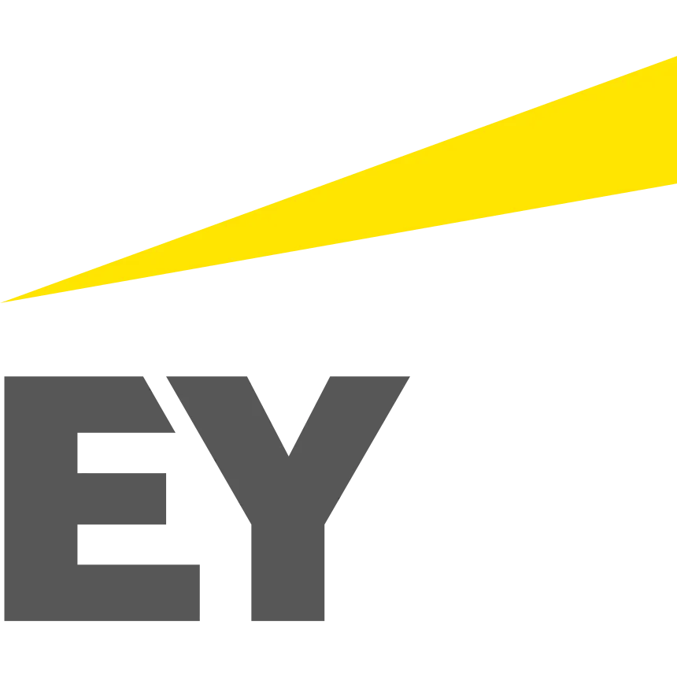
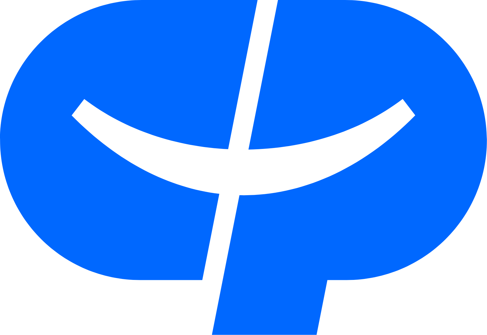
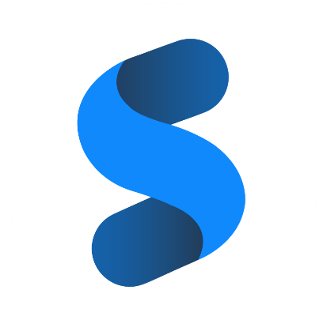
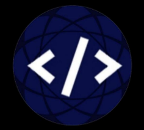

<div align="center">


<a href="https://github.com/Ken-Kanike">


</a>

<br>

<!-- LIVE METRICS -->
<a href="https://github.com/Ken-Kanike">
  
</a>


</div>

<br>
<hr>
<br>

<table width="100%" border="0" cellspacing="0" cellpadding="0">

<h2>👋 Initialize <code>Profile.exe</code></h2>
<tr>
<td width="55%" valign="top">

```typescript
const junaid = {
  name: "Junaid Shaikh",
  username: "@Ken-Kanike",
  location: "Mumbai, India 🇮🇳",
  education: "Engineering Student",
  expertise: [
    "🤖 AI/ML & Agentic Systems",
    "💻 Full-Stack Development",
    "📱 Mobile Apps (Android/React Native)",
    "🎨 UI/UX Design & Animations"
  ],
  motto: "Unraveling The Future of AI",
};
```

</td>
<td width="45%" align="center" valign="top">
<br>


</td>
</tr>
</table>

<br>
<hr>
<br>

<h2 align="center">💼 Professional Experience</h2>

<p align="center">
  
</p>

<br>

<!-- CARD 1: 30% Company/Logo | 70% Role & Description -->
<table width="100%" border="0" cellspacing="0" cellpadding="14">
<tr>
<td width="30%" align="center" valign="middle">
<font color="#00D9FF"><b>EXPERIENCE</b></font>
<br><br>
<a href="https://www.ey.com/en_in" target="_blank">
  
</a>
<br><br>
<h3><b>EY GDS (Ernst & Young)</b></h3>
</td>

<td width="70%" valign="top">
<h2>AI & Automation Intern</h2>
<p>🗓️ <b>August 2026 – Ongoing</b></p>
<p>
Developing enterprise AI automation solutions with <b>Azure AI</b>, <b>AWS Bedrock</b>, <b>LLMs</b>, <b>RAG</b>, and advanced prompt engineering. Architecting <b>LangGraph multi-agent systems</b> with autonomous tool orchestration, persistent memory systems, and <b>Model Context Protocol (MCP)</b> integrations for automated intelligence workflows.
</p>
<br>


</td>
</tr>
</table>

<br>

<!-- CARD 2: 70% Role & Description | 30% Company/Logo -->
<table width="100%" border="0" cellspacing="0" cellpadding="14">
<tr>
<td width="70%" valign="top">
<h2>Data Analyst Intern</h2>
<p>🗓️ <b>June 2026 – July 2026</b></p>
<p>
Automating enterprise data pipelines and workflows, developing AI-driven intelligence solutions, performing deep business data analytics, and driving measurable operational efficiency gains across cross-functional enterprise teams.
</p>
<br>


</td>

<td width="30%" align="center" valign="middle">
<font color="#00D9FF"><b>EXPERIENCE</b></font>
<br><br>
<a href="https://www.colgatepalmolive.com/" target="_blank">
  
</a>
<br><br>
<h3><b>Colgate-Palmolive</b></h3>
</td>
</tr>
</table>

<br>

<!-- CARD 3: 30% Company/Logo | 70% Role & Description -->
<table width="100%" border="0" cellspacing="0" cellpadding="14">
<tr>
<td width="30%" align="center" valign="middle">
<font color="#00D9FF"><b>EXPERIENCE</b></font>
<br><br>
<a href="https://shubhchintak.co/" target="_blank">
  
</a>
<br><br>
<h3><b>Shubhchintak Technology</b></h3>
</td>

<td width="70%" valign="top">
<h2>Full Stack Developer Intern</h2>
<p>🗓️ <b>May 2025 – Jul 2025</b></p>
<p>
Developed high-performance full-stack web applications with <b>Next.js</b>, <b>React</b>, <b>Node.js</b>, <b>Prisma ORM</b>, and <b>Strapi CMS</b>. Built automated business pipelines, payment gateway integrations, and scalable business solutions.
</p>
<br>


</td>
</tr>
</table>

<br>

<!-- CARD 4: 70% Role & Description | 30% Company/Logo -->
<table width="100%" border="0" cellspacing="0" cellpadding="14">
<tr>
<td width="70%" valign="top">
<h2>Web & Android Developer Intern</h2>
<p>🗓️ <b>Jun 2024 – Jul 2024</b></p>
<p>
Created responsive web applications and Android mobile applications using <b>Java</b>, <b>Firebase Realtime Database</b>, <b>WordPress</b>, and modern web frameworks, delivering fast, accessible, and user-centric digital experiences.
</p>
<br>


</td>

<td width="30%" align="center" valign="middle">
<font color="#00D9FF"><b>EXPERIENCE</b></font>
<br><br>
<a href="https://prayasdevelopers.com/" target="_blank">
  
</a>
<br><br>
<h3><b>Prayas Developers</b></h3>
</td>
</tr>
</table>

<br>
<hr>
<br>

<h2 align="center">⚙️ System Configuration (Tech Stack)</h2>
<p align="center"><i>Hover over the icons to see them pop!</i></p>

<div align="center">
<table width="100%" border="0" align="center" cellpadding="6">
<tr>
<td align="center" valign="top" width="25%">
<h3>🤖 AI & ML</h3>
<a href="https://skillicons.dev">
  
</a>
<br><br>

<br>

<br>

<br>

<br>

<br>

<br>

<br>

<br>

</td>

<td align="center" valign="top" width="25%">
<h3>🌐 Frontend</h3>
<a href="https://skillicons.dev">
  
</a>
<br><br>

<br>

</td>

<td align="center" valign="top" width="25%">
<h3>⚙️ Backend</h3>
<a href="https://skillicons.dev">
  
</a>
<br><br>

<br>

<br>

<br>

</td>

<td align="center" valign="top" width="25%">
<h3>🗄️ Cloud & DB</h3>
<a href="https://skillicons.dev">
  
</a>
<br><br>

<br>

<br>

</td>
</tr>
</table>
</div>
<br>
<hr>


<div align="center">
  <h2>📊 Developer Analytics</h2>

  <table align="center" border="0" cellspacing="0" cellpadding="0">
    <tr>
      <td align="center">
        
      </td>
    </tr>
  </table>

  <br>

  
</div>

<br>

<div align="center">
  <h2>📡 Establish Connection</h2>
  <p><i>Status: Open to internships, full-time & AI engineering roles.</i></p>

  <a href="mailto:junaidshaikh.coding@gmail.com">
    
  </a>
  <a href="https://linkedin.com/in/junaid-shaikh-b52918271" target="_blank">
    
  </a>
  <a href="https://github.com/Ken-Kanike" target="_blank">
    
  </a>
  <a href="https://leetcode.com/u/ZeroToMythic/" target="_blank">
    
  </a>
  <a href="https://codeforces.com/profile/ZeroToMythic" target="_blank">
    
  </a>
  <a href="https://x.com/ZeroToMythic" target="_blank">
    
  </a>
  <a href="https://www.threads.net/@zerotomythic" target="_blank">
    
  </a>
  <a href="https://www.instagram.com/zerotomythic" target="_blank">
    
  </a>

  <br><br>

  
</div>
